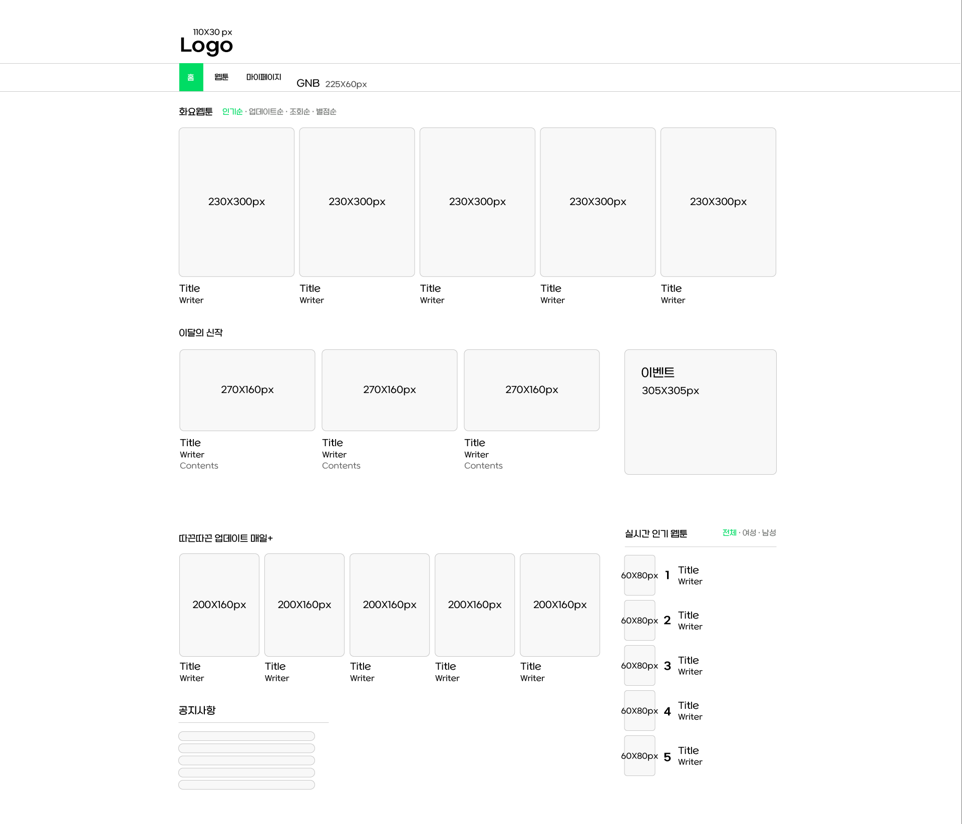
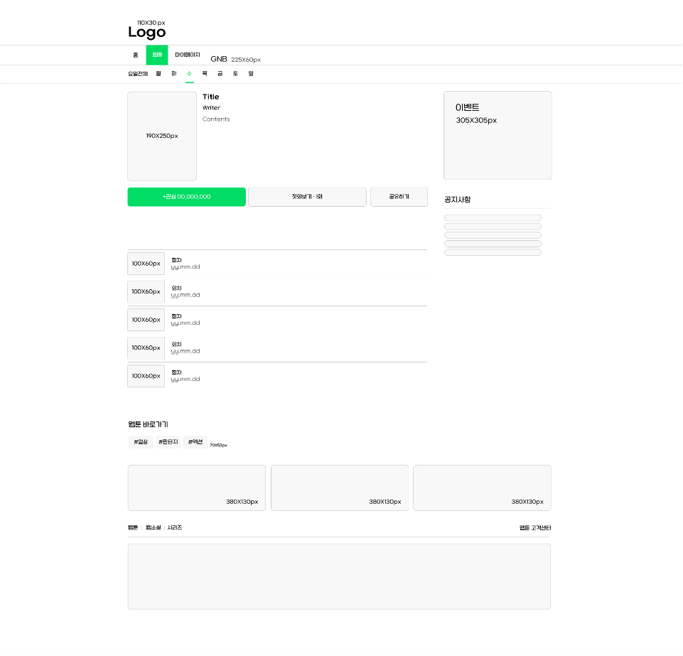
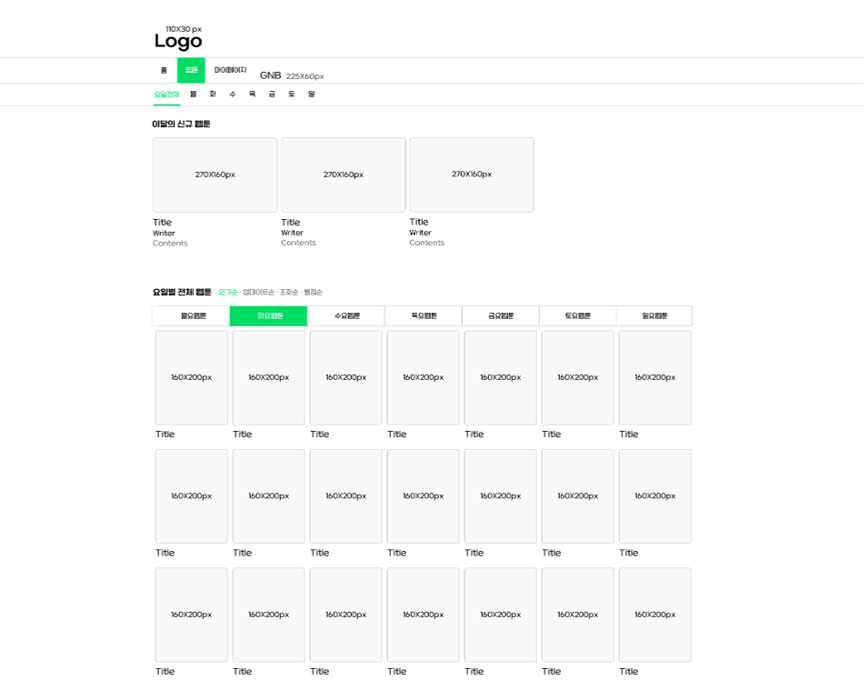
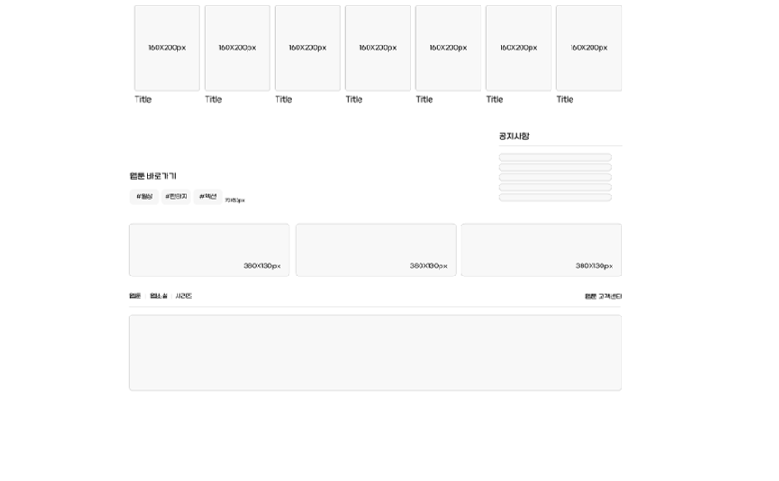
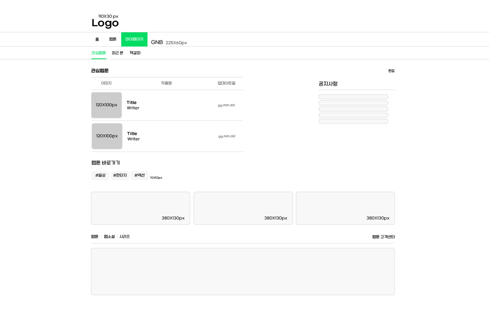
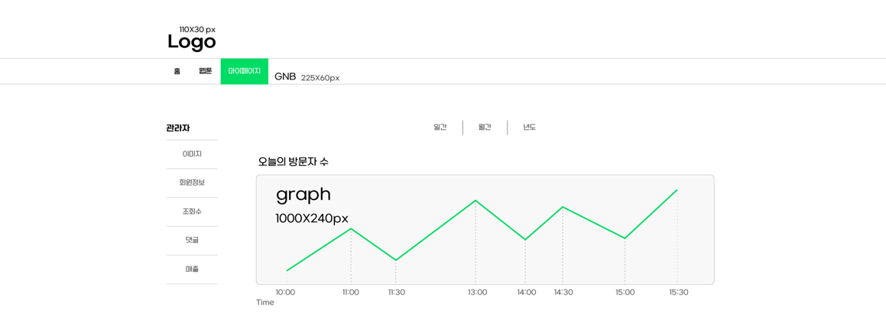
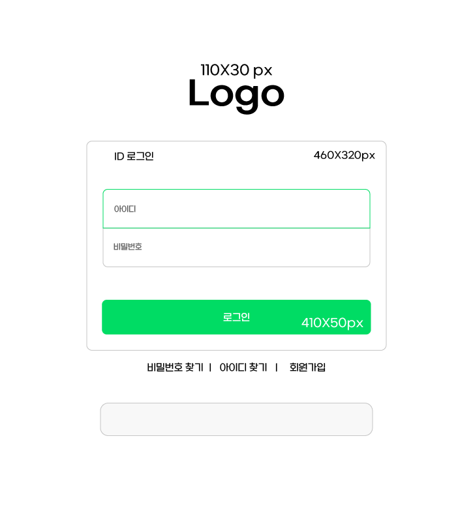
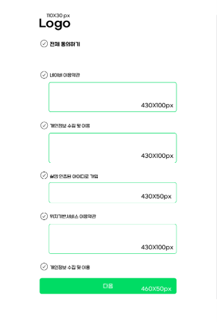

# CloverWebtoon 🍀
네이버 웹툰을 벤치마킹하여 제작한 웹툰 플랫폼 프로젝트입니다.
교육 과정에서 학습한 기술 스택을 바탕으로 개발된 프로젝트로, 사용자와 관리자 페이지를 포함한 다양한 기능을 구현하였습니다.


<hr>


## 📌 프로젝트 소개
CloverWebtoon은 웹툰을 탐색, 열람, 업로드 및 관리할 수 있는 웹 기반 플랫폼입니다.
네이버 웹툰의 주요 기능을 참고하여 사용자가 친숙하게 느낄 수 있는 UI/UX를 제공하며, 교육 과정에서 배운 기술을 활용하여 기능을 구현하였습니다.


<hr>


## 📋 주요 기능
- **메인 페이지**: 카테고리별 웹툰 탐색 및 추천 웹툰 열람
- **웹툰 뷰 페이지**: 웹툰 회차 열람 및 댓글 작성 (로그인 필요)
- **웹툰 업로드 페이지**: 관리자 페이지에서 새로운 웹툰 및 회차 업로드
- **관리자 페이지**: 방문자 통계, 사용자 관리, 댓글 관리, 매출 관리
- **로그인 및 회원가입**: 사용자 인증 및 회원 관리 기능
- **내 정보 페이지**: 사용자 정보 수정, 비밀번호 변경, 회원 탈퇴
- **공지사항 페이지**: 플랫폼 공지사항 열람 및 작성


<hr>


## 🛠️ 기술 스택
### Front-end
<div> 
   
   
   
   
</div>

### Back-end
<div> 
   
   
   
</div>

### Database
<div> 
   
   
</div>

### Tools
<div> 
   
</div>


<hr>

## 💡 시스템 설계: 와이어프레임
와이어프레임은 프로젝트 초기 설계 단계에서 작성되었으며, 사용자 동선 및 레이아웃 구상을 기반으로 개발이 진행되었습니다.
| **메인 페이지**           | **웹툰 회차 페이지 1**         |
|---------------------------|---------------------------|
|  |  |

| **웹툰 페이지 1**         | **웹툰 페이지 2**      |
|---------------------------|---------------------------|
|      |  |

| **마이 페이지**           | **관리자 페이지**         |
|---------------------------|---------------------------|
|              |        |

| **로그인 페이지**         | **회원가입 동의 페이지**  |
|---------------------------|---------------------------|
|          |  |


<hr>


## 🖥️ 시스템 구현: 주요 페이지
구현된 주요 페이지를 통해 설계와 실제 구현된 화면의 결과를 확인할 수 있습니다.


<hr>


## 🔄 페이지 플로우 차트
페이지별 플로우 차트는 사용자의 동선과 기능 흐름을 시각적으로 설명합니다.


<hr>


## 🚀 설치 및 실행 방법
### 1. 저장소를 클론합니다:
```bash
git clone https://github.com/your-username/CloverWebtoon.git
```
<br>

### 2. 프로젝트를 IntelliJ IDEA 혹은 STS4에 가져옵니다.
#### 1) IntelliJ IDEA
- File → Open → 프로젝트 폴더 선택 → 열기.
- Maven을 사용하는 경우, IntelliJ에서 자동으로 pom.xml 파일을 읽어 의존성을 설정합니다.
#### 2) STS4
- File → Import → Existing Maven Project 선택 → 프로젝트 폴더 선택 → Finish.
<br>

### 3. 데이터베이스 설정
#### 1) 스키마 생성
- schema.sql 파일을 사용해 MySQL 데이터베이스에 필요한 테이블 및 초기 데이터를 생성합니다.
  ```bash
  mysql -u [username] -p [database_name] < schema.sql
  ```
#### 2) application.properties 설정
- src/main/resources/application.properties 파일을 열어 데이터베이스 연결 정보를 수정합니다.
  ```bash
  spring.datasource.url=jdbc:mysql://localhost:3306/your_database_name
  spring.datasource.username=your_username
  spring.datasource.password=your_password
  ```
  <br>

### 4. Spring Boot 애플리케이션 실행
#### 아래 두 가지 방법 중 하나를 선택하여 실행합니다:

#### 방법 1: IntelliJ IDEA 또는 STS4에서 실행
① src/main/java 디렉토리에서 @SpringBootApplication이 붙은 메인 클래스(예: Application.java)를 찾습니다. <br>
② 해당 파일을 오른쪽 클릭 → Run 'Application' 또는 Run As > Spring Boot App을 선택합니다.<br>

#### 방법 2: 터미널에서 실행
① 프로젝트 루트 디렉토리에서 아래 명령어를 실행합니다.
```bash
./mvnw spring-boot:run
```
<br> ② Maven이 설치되어 있다면 아래 명령어도 가능합니다.
```bash
mvn spring-boot:run
```
<br>

### 5. 브라우저에서 애플리케이션에 접근
브라우저를 열고 아래 URL로 이동합니다.
```bash
http://localhost:8080
```


<hr>


### 👥 팀 구성 및 역할


<hr>


### 📢 프로젝트 후기
이 프로젝트는 교육 과정에서 학습한 기술 스택을 기반으로 팀원들과 협업하며 완성된 결과물입니다.
네이버 웹툰의 기능을 벤치마킹하며 개발 과정 전반에 걸쳐 설계, 구현, 테스트를 경험할 수 있었습니다.
이를 통해 실무에 적용 가능한 풀스택 개발 경험을 쌓을 수 있었습니다.


